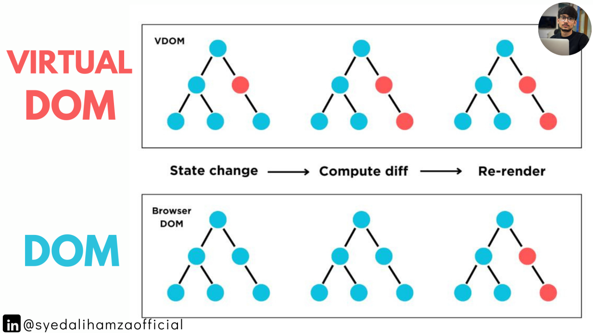
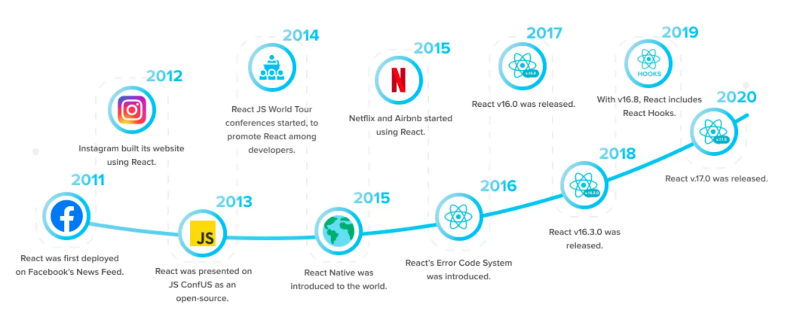

# Clase 02 - React.js Developer

## Extensiones

* dsznajder.es7-react-js-snippets


## Instalando Tailwind en Vite con React

<https://tailwindcss.com/docs/installation/using-vite>

```sh
npm install tailwindcss @tailwindcss/vite
```

## Agregando el plugin de tailwind en vite.config.js

```js
import { defineConfig } from 'vite'
import react from '@vitejs/plugin-react'
import tailwindcss from '@tailwindcss/vite' // <---------

// https://vite.dev/config/
export default defineConfig({
  plugins: [react(), tailwindcss()], // <------
})

```

### Agregar la hoja de estilos de tailwind

```css
@import "tailwindcss";
```

## JSX (JavaScript XML) NO ES HTML -> Extension de Javascript
Extiende a JS que permite escribir código que se parece HTML dentro de los archivos .js/.jsx

```jsx
const element = <h1>Hola mundo</h1>
const cadena = "commillas"
```

**Nota:** No es obligatorio pero muy útil.

```js
const element = React.createElement('h1', null, 'Hola mundo')
const h1 = document.createElement('h1')
```


## Virtual DOM (Copia del DOM REAL -> En Memoria)
Es una representación liviana del DOM real en memoria.

1. Crea una nueva versión del Virtual DOM
2. Lo comparar con la versión anterior (reconciliación)
3. Calcula la diferencia (diffing algorithm)
4. Actualiza solo lo necesario en el DOM real.

Mucha potencia y velocidad



## Componentes
Basado en componentes. Un componente es una función. Los componentes gracias a eso van a ser reutilizables. Un componente es un archivo. En versiones anteriores a la 16.8 los componentes eran clases. A partir de la versión 16.8 los componentes (funciones) tienen estado y pueden utilizarse en React.



