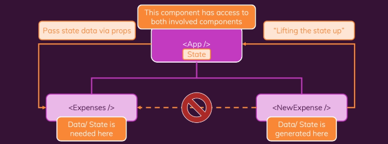

# Subiendo el estado

<https://es.react.dev/learn/sharing-state-between-components>

<https://es.legacy.reactjs.org/docs/lifting-state-up.html>

## Gestión de formularios con Formik

<https://formik.org/>